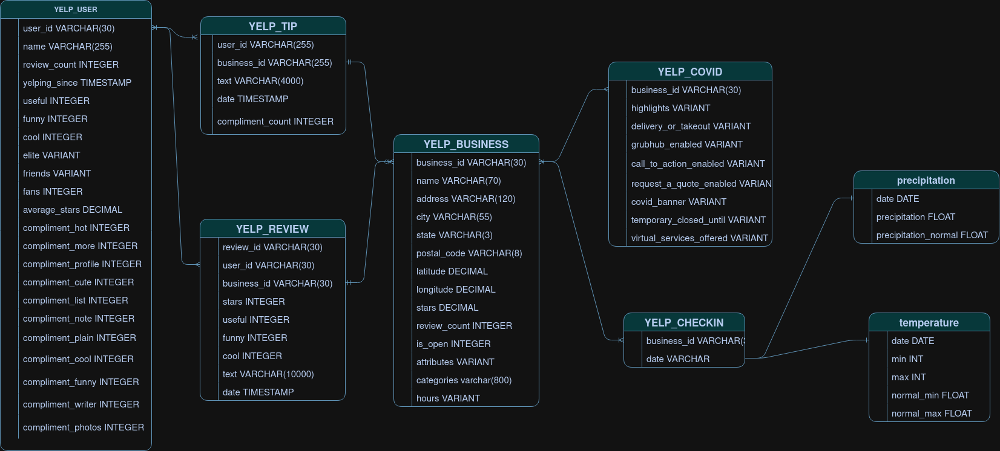

# Weather Effects on Yelp Reviews Data Warehouse Project

## Project Overview
This project analyzes the effects of weather on customer reviews of restaurants using YELP and climate datasets. We utilize Snowflake, a cloud-native data warehouse system, to process and analyze the data. The project demonstrates the end-to-end process of building a data warehouse, from raw data ingestion to insightful analysis.

## Data Architecture

Our data pipeline consists of the following stages:
1. Multiple data sources
2. Staging
3. Operational Data Store (ODS)
4. Data Warehouse
5. Reporting

## Data Sources
- YELP Dataset (JSON format):
  - Tip
  - User
  - Review
  - Business
  - Check-in
  - COVID
- Climate Data (CSV format):
  - Temperature
  - Precipitation

## Project Structure

### 1. Staging Environment
- Created a staging schema in Snowflake
- Uploaded all Yelp and Climate data to staging tables:
  - YELP_TIP_TEMP
  - YELP_USER_TEMP
  - YELP_REVIEW_TEMP
  - YELP_BUSINESS_TEMP
  - YELP_CHECKIN_TEMP
  - YELP_COVID_TEMP
  - TEMPERATURE_TEMP
  - PRECIPITATION_TEMP

### 2. Operational Data Store (ODS)
- Created an ODS schema with normalized tables
- Migrated data from staging to ODS

### 3. Data Warehouse
- Implemented a star schema design:
  - Fact table: FACT_REVIEW
  - Dimension tables: DIM_BUSINESS, DIM_USER, DIM_REVIEW, DIM_DATE, DIM_TEMP
- Migrated data from ODS to Data Warehouse

### 4. Reporting
- Queried the Data Warehouse to analyze the relationship between weather and Yelp reviews

## Setup Instructions
1. Ensure you have at least 10GB of free disk space
2. Download the YELP JSON dataset (4.04GB compressed) from the [YELP Dataset](https://www.yelp.com/dataset)
3. Split large datasets into smaller files (<3 million records per file) using PineTools or 7zip
4. Create Snowflake schemas for Staging, ODS, and Data Warehouse
5. Upload data to Staging environment
6. Migrate data through ODS to Data Warehouse
7. Execute analysis queries

## Project Deliverables
- Data architecture diagram
- Entity-Relationship (ER) diagram for ODS
- STAR schema diagram for Data Warehouse
- Screenshots of data upload and migration processes
- Final analysis queries and results

## Tools Used
- Snowflake
- JSON and CSV data processing tools
- SQL for data transformation and analysis

## Notes
- Large files may need to be split before uploading to Snowflake
- Verify split data to avoid parsing errors during upload

## Future Improvements
(Add any potential enhancements or additional analyses that could be performed)
